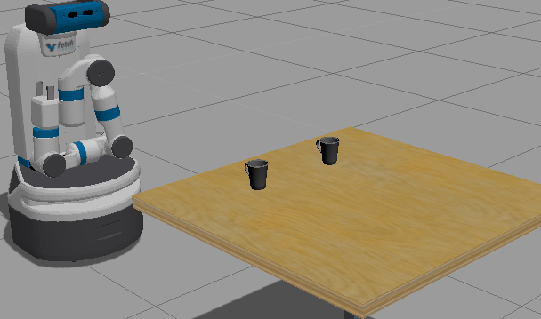
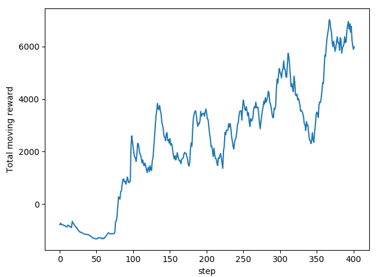
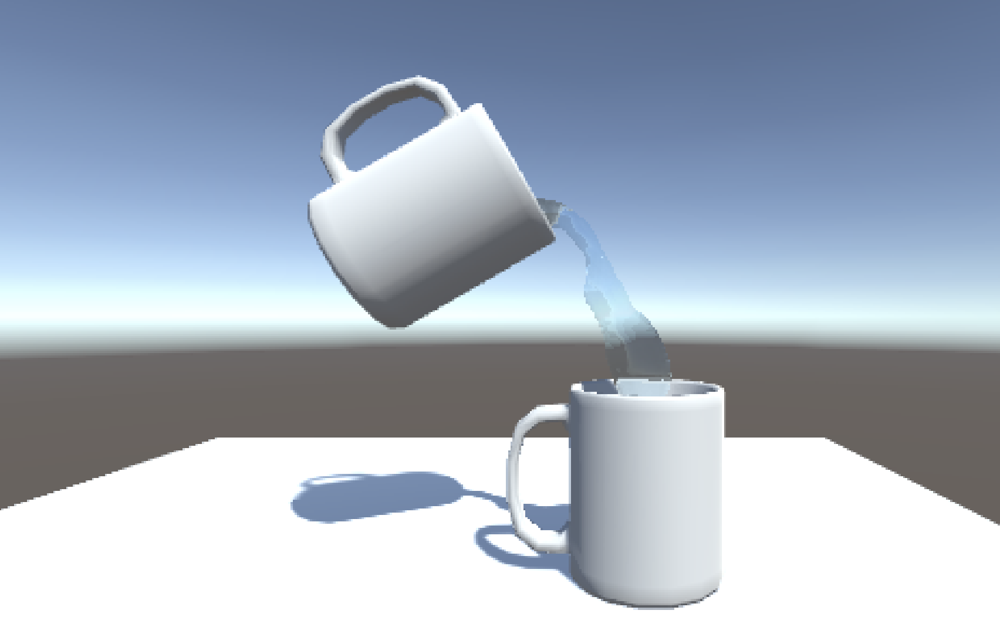
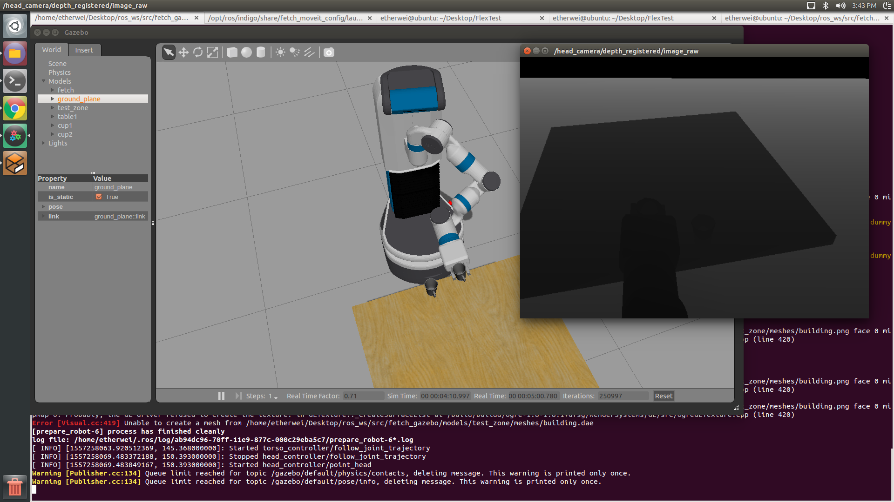

# Learning to Pour with Reinforcement Learning
### CS 6731 Humanoid Robotics course project
### Bingqing Wei, Qiang Ma, Yuchen Mo

The purpose of this project is to learn a pouring policy for the robot using reinforcement learning. Two pouring situations are considered in our project, including pouring all liquid in the container and pouring an accurate amount of liquid. The pouring policy is represented by a neural network, which is trained on a fluid simulation environment based on Unity. The policy network can be trained using different policy gradient algorithms. Besides, we implemented an interface which allows the pouring policy to be applied to the robot directly.

## Simulation
Include Fetch environment and interface to policy model.

## Training
Include A3C code and saved model.

## Unity Engine File
The Unity pouring environment is uploaded to Google Drive:
https://drive.google.com/file/d/1KCLKcPBpiEU7_4GAtki_Y4yCghJ7A_co/view?usp=sharing

##  Video
Multi-agent training scene:
https://youtu.be/rOD9qzz6RC8

Pouring:
https://youtu.be/B17nsjaB2KU

Fetch simulation:
https://youtu.be/te8icsWMvW0

